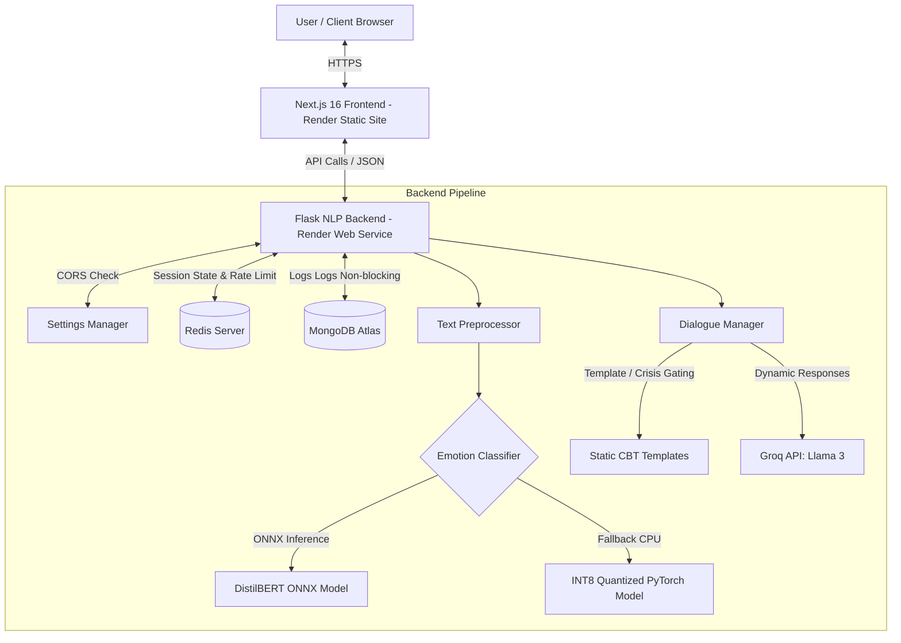

# COMPASS — Cognitive & Mental Processing Advisory Support System

**B.Sc. Computer Science Final Year Project**  
**Department of Computer Science, Babcock University, Ilisan-Remo, Ogun State, Nigeria**  
**Developer:** Deji (Computer Science Department)

---

## 📌 Project Abstract & Overview
Mental health support remains highly inaccessible due to societal stigma, financial constraints, and a shortage of professional therapists. **COMPASS** is a secure, anonymous web platform designed to provide emotional support, active cognitive behavioral therapy (CBT) techniques, and mental wellness guidance.

The system utilizes a dual-model hybrid architecture:
1. **Local Emotion Classification (DistilBERT):** A fine-tuned sequence classification model that analyzes the user's message to classify their emotional state (Anxiety, Depression, Anger, Confusion, Sadness, Neutral, or Suicidal/Crisis).
2. **Context-Aware Dialogue (Llama 3 via Groq):** Generates empathetic responses dynamically calibrated to the user's current emotion context and conversation history.
3. **Safety Guardrails & Crisis Gating:** If thoughts of self-harm or suicide are detected, the system immediately bypasses the LLM and intercepts with professional emergency resources focused on Nigerian crisis support lines.

---

## 🏗️ System Architecture



---

## 🌟 Key Features & Technical Implementations

### 1. Emotion-Gated Empathetic Chat (DistilBERT + Llama 3)
* **Real-time Emotion Gating:** When a user types a message, the backend classifies the sentiment. The detected emotion and confidence score are sent back to the frontend.
* **Empathetic Response Calibration:** The Groq-powered Dialogue Manager combines the detected emotion label, confidence level, and last 5 exchanges of session history to steer the response tone.
* **Premium Indicators:** The UI displays a custom emotion badge (representing emotions like `Anxious` 😰, `Depressed` 😔, or `Calm` 😐) along with a progress bar indicating model confidence.

### 2. High-Fidelity Crisis Safety Net
* **Model & Keyword Triggers:** Suicidal thoughts or self-harm keywords bypass the Groq LLM entirely.
* **Automatic Emergency Action:** The system triggers an instant modal presenting Nigerian mental health support hotlines:
  * **Nigeria Suicide Prevention Initiative (NSPI):** `0800-7842433`
  * **Mentally Aware Nigeria Initiative (MANI):** `+234 809 111 6264`
  * **SURPIN (Suicide Research & Prevention Initiative):** `+234 908 021 7555`
* **Real-Time Warning Toasts:** Simultaneously pops up high-priority warning toasts notifying the user that help is available.

### 3. ML Optimizations for CPU Deployments
* **ONNX Runtime Engine:** Speeds up DistilBERT classification by **2x to 4x** on standard server CPUs compared to traditional PyTorch runs.
* **INT8 Quantization Fallback:** Utilizes dynamically quantized 8-bit weights for PyTorch to decrease memory foot-print and improve CPU execution speed.
* **Warmup Cycles:** Runs a dummy inference at server startup so the very first user message does not suffer from cold-start latency.

### 4. Multilingual Input Support
* Supports **English**, **Yorùbá**, and **Nigerian Pidgin English** (`en`, `yo`, `pcm`).
* Integrates translation providers to normalize non-English text to English before emotional analysis.

### 5. Production Infrastructure
* **CORS Configurations:** Dynamically allows localhost development, Vercel deployments, and production URLs.
* **Redis Caching & Rate Limiting:** Avoids repeated classifier calls for identical texts using SHA256 caching keys. Protects the server via sliding window rate limits.
* **MongoDB Logging:** Asynchronously writes session metadata, detected emotions, confidence, and system response latencies for future research and model evaluation.

---

## ⚙️ Tech Stack
* **Frontend:** Next.js 16, React 19, TypeScript, Tailwind CSS, Lucide icons, Sonner (Toasts), Radix UI.
* **Backend:** Python 3.12, Flask, Gunicorn (production server), Transformers, ONNX Runtime.
* **Infrastructure:** Render (Backend Web Service & Frontend Static Site), MongoDB Atlas, Redis Cloud (Vercel has been completely removed).

---

## 🛠️ Installation & Setup

### Prerequisites
* Node.js (v18+)
* Python (v3.10+)
* Redis Server (optional for local caching)
* MongoDB (optional for local logging)

### 1. Backend Setup
1. Navigate to the `backend` directory:
   ```bash
   cd backend
   ```
2. Install dependencies:
   ```bash
   pip install -r requirements.txt
   python -m spacy download en_core_web_sm
   ```
3. Setup environment variables:
   Copy `.env.example` to `.env` and fill in your keys:
   ```bash
   cp .env.example .env
   ```
   *Make sure to configure your `GROQ_API_KEY`, `MONGO_URI`, and `REDIS_URL`.*
4. Start the server:
   ```bash
   python app.py
   ```
   The backend will run on `http://localhost:5000` (or the port defined in `.env`).

### 2. Frontend Setup
1. Navigate to the root folder:
   ```bash
   cd ..
   ```
2. Install Node modules:
   ```bash
   npm install
   ```
3. Configure frontend endpoints:
   Copy `.env.example` to `.env.local` and set the backend API endpoint:
   ```bash
   NEXT_PUBLIC_API_URL=http://localhost:5000
   ```
4. Run the Next.js development server:
   ```bash
   npm run dev
   ```
5. Open your browser and navigate to `http://localhost:3000`.

---

## 🚀 Production Deployment on Render

Both the frontend and backend are deployed together under Render's unified ecosystem, completely eliminating Vercel and resolving CORS constraints:

1. **Backend Web Service (`compass-backend`):** Serves the Flask NLP API.
2. **Frontend Static Site (`compass-frontend`):** Built statically and hosted for free on Render's global CDN.
3. **CORS Gating & Dynamic URLs:** During the static build on Render, the `NEXT_PUBLIC_API_URL` environment variable is compiled into the static frontend assets, enabling direct absolute requests to the backend without relying on redirect rewrites (which avoids Method Not Allowed 405 errors).

All of this is defined and managed automatically in the root [render.yaml](file:///c:/Users/HP/Desktop/COMPASS-frontend/render.yaml) blueprint specification file.

---

## 🎓 Babcock University Computer Science Presentation Focus
When presenting this project to the panel:
* **Highlight NLP Pipeline Architecture:** Detail the sequence of validation -> pre-processing -> emotion classification -> dialog generation.
* **Emphasize Optimization Decisions:** Explain the choice of **ONNX runtime** and **dynamic quantization** to solve resource constraints on free/starter tiers.
* **Demo the Safety Controls:** Trigger a mock self-harm statement (e.g. *"I want to end it all"*) to show the instant redirection to the Nigerian Hotline Dialog and Toast alerts.
